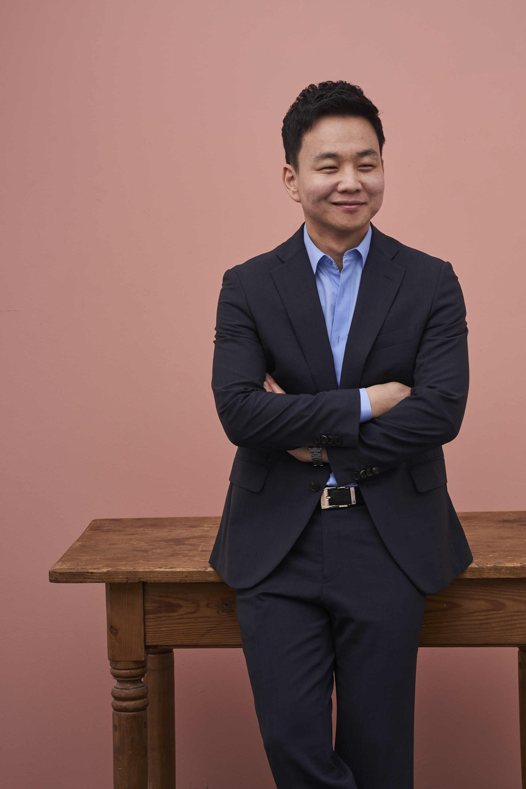

---
layout: page
title: About us
no_groups: true

description: >
  *Team of specialists in financial technologies for OTC market*
hide_description: true
--- 

#### *Team of specialists in financial technologies for OTC market*

<!-- members -->
## Keunho Hwang (CEO) 
* Meritz Securities      
* Daishin Securities     
* Ph.D., Finance, KAIST  
* B.A., Economics, Seoul National Univ.

{:width="260" height="190.4" loading="lazy"}

### Sue-Jeong Kwon (QFIT Director)
* Research professor, Korea polytechnic university
* SW Engineer, LG CNS
* M.S. / Ph.D., Industrial Engineering, Seoul National Univ.
* B.S., Computer Science, Seoul National Univ.

### Yujin Hur (Data Analyst)
* Analyst, Korea asset pricing     
* B.S., Financial Engineering, Ajou Univ. 

### Kwanghyun Yi (Data Analyst)
* M.S., Financial Engineering, KAIST 
* B.A., Economics, Sogang Univ.

### <i class="fa fa-envelope-o fa-2x"></i> &nbsp; [Get in touch!](mailto:admin@qvious.com)
> **Please send us a message, and we'll be in contact shortly.   We welcome inquiry messages with open arms.**     