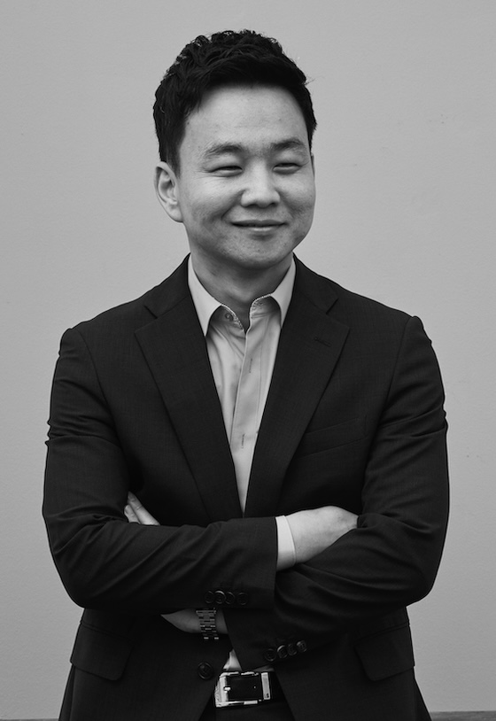

#### *Team of specialists in financial technologies for OTC market*

<!-- members -->
## Keunho Hwang (CEO) 
* Meritz Securities     <br>
* Daishin Securities    <br>
* Ph.D., Finance, KAIST <br>
* B.A., Economics, Seoul National Univ.

{:width="260" height="190.4" loading="lazy"}

### Sue-Jeong Kwon (QFIT Director)
* Research professor, Korea polytechnic university
* SW Engineer, LG CNS
* M.S. / Ph.D., Industrial Engineering, Seoul National Univ.
* B.S., Computer Science, Seoul National Univ.

### Yujin Hur (Data Analyst)
* Analyst, Korea asset pricing     
* B.S., Financial Engineering, Ajou Univ. 


### Kwanghyun Yi (Data Analyst)
* M.S., Financial Engineering, KAIST 
* B.A., Economics, Sogang Univ.


<hr>


### <i class="fa fa-envelope-o fa-2x"></i> &nbsp; [Get in touch!](mailto:admin@qvious.com)
> **Please send us a message, and we'll be in contact shortly. <br> We welcome inquiry messages with open arms.** 

<!-- 
cover page on a variety of screens.
{:.figcaption}

```js
// file: `example.js`
document.querySelector("hy-push-state").addEventListener("hy-push-state-load", () => {
  const supportsCodeHighlights = true; //!!
});
```

$$
\begin{aligned}
  \phi(x,y) &= \phi \left(\sum_{i=1}^n x_ie_i, \sum_{j=1}^n y_je_j \right) \\[2em]
            &= \sum_{i=1}^n \sum_{j=1}^n x_i y_j \phi(e_i, e_j)            \\[2em]
            &= (x_1, \ldots, x_n)
               \left(\begin{array}{ccc}
                 \phi(e_1, e_1)  & \cdots & \phi(e_1, e_n) \\
                 \vdots          & \ddots & \vdots         \\
                 \phi(e_n, e_1)  & \cdots & \phi(e_n, e_n)
               \end{array}\right)
               \left(\begin{array}{c}
                 y_1    \\
                 \vdots \\
                 y_n
               \end{array}\right)
\end{aligned}
$$
!-->
