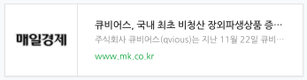

주식회사 큐비어스(Qvious)는 지난 11월 22일 큐비어스에서 개발한 **개시증거금 산출시스템 ‘QvIM’**이 <a href="#"> **국내 최초**</a>로 국제스왑파생상품협회 (The International Swaps and Derivatives Association, Inc: ISDA)의 표준 개시증거금 산출 모형인 SIMDA2.2의 단위테스트를 통과한 내용이 매일경제 신문에 기사로 소개되었습니다.

> [기사원문](https://www.mk.co.kr/news/stock/view/2019/11/999445/)

