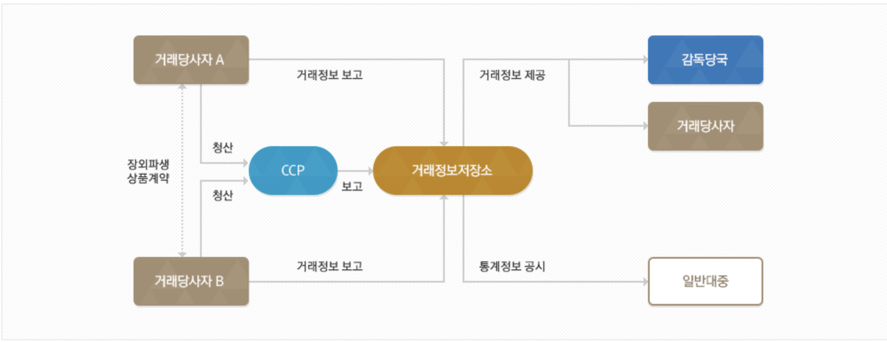

> 큐비어스(Qvious)는 2019년 11월 부터 2020년 3월까지 한국씨티은행(CKI)의 TR 보고 시스템 구축 컨설팅 프로젝트를 성공적으로 수행하였습니다.
> 5월부터 시스템 개발 프로젝트에 연이어 참여하고 있으며, 데이터 구축 및 시스템 개발을 수행하고 있습니다.  

---
* **Our TR Reporting Consulting is..**
  - TR 보고 시스템 구축 컨설팅
  - KRX - TR 보고 항목 요건 및 데이터 생성 지원 
* **What is TR?**
  - 거래정보 저장소(TR; Trade Repository)란 장외파생상품 거래에 대한 세부 정보를 중앙집중화하여 수집, 보관 및 관리하는  
  새로운 금융시장 인프라입니다.
  - TR은 축적된 거래정보를 활용하여 장외파생상품 관련 통계정보를 공시하고, 감독 당국의 정책 수행에 필요한 정보를 제공하는   
  역할을 수행합니다.

> [출처: KRX-TR](https://tr.krx.co.kr/)